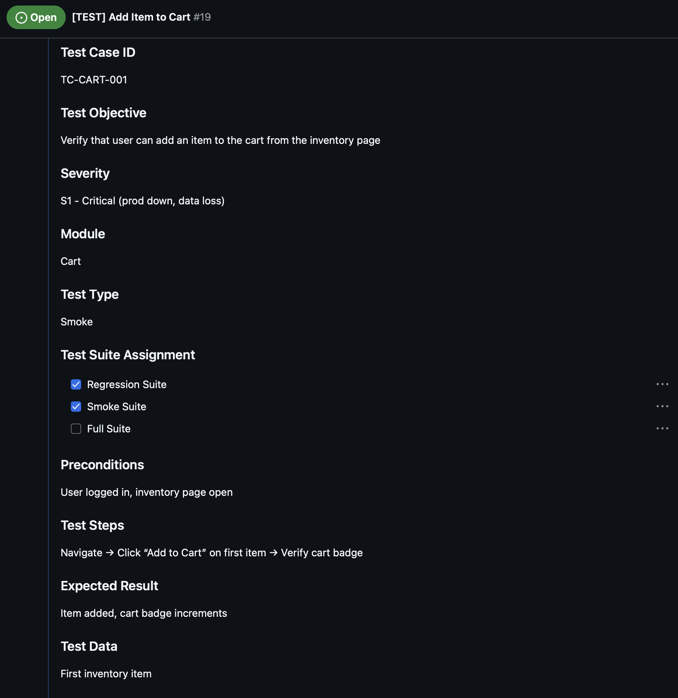
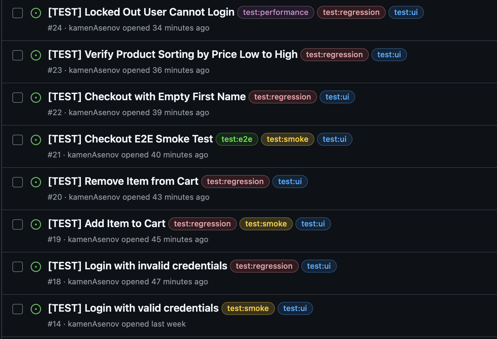

This week I learned how to structure test cases with clear objectives, steps, expected results, and test data. I practiced converting test cases into GitHub issues, adding labels, statuses, and linking them to projects for proper test management. I also gained experience testing different modules of SauceDemo, including login, cart, and checkout, covering positive, negative, boundary, and security scenarios.